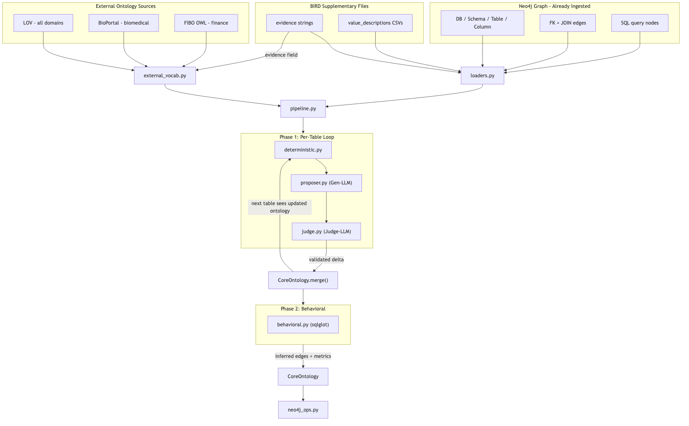
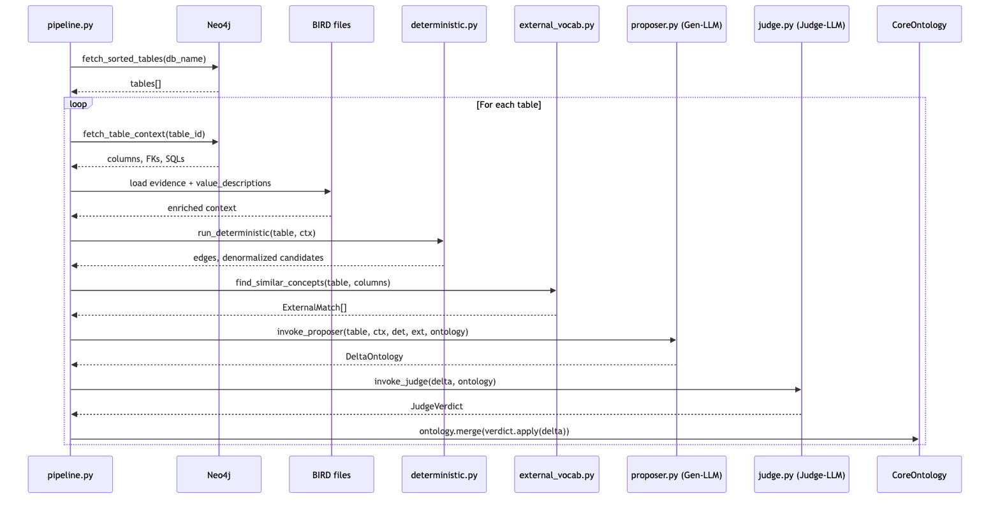
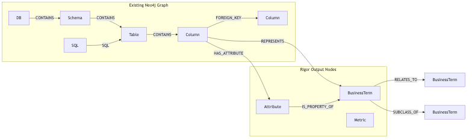

# Rigor: Semantic Layer Compilation Pipeline

Evolved from iterative per-table construction to BFS-from-seed semantic
compilation with five phases: seed selection, BFS expansion, role synthesis,
orphan fallback, and coverage sweep. See ``gsf/ontology/rigor/compile.py``.

## Input Data Sources

### Primary: Neo4j graph (already ingested)

The schema is already in Neo4j via NeMo-Retriever ingestion. The pipeline reads from the existing graph:

- **DB / Schema / Table / Column nodes** -- full catalog tree via `:CONTAINS` edges
- **Foreign keys** -- `(Column)-[:FOREIGN_KEY]->(Column)` edges
- **SQL queries** -- `(SQL)-[:SQL]->(Table)` and `(SQL)-[:SQL]->(Column)` edges, with `sql_full_query` and `total_counter` properties
- **JOIN edges** -- `(Table)-[:JOIN]->(Table)` edges inferred during ingestion
- **Column metadata** -- `name`, `data_type`, `description`, `sample_values`, `ordinal_position`

Existing query patterns from [attributes_extraction.py](gsf/ontology/attributes_and_concepts/attributes_extraction.py) are reused: `_FETCH_TABLES_QUERY`, `_FETCH_COLUMNS_QUERY`, `_FETCH_FKS_QUERY`, `_FETCH_SQL_TEXTS_QUERY`.

### Domain summary (optional, Phase 0)

- **DomainSummary** — loaded from `.semantic_summaries/{database_name}.json` or produced by domain pre-reading. Used for seed selection and proposer context.

### External ontology sources (domain-mapped)

- **LOV (Linked Open Vocabularies)** -- REST API `https://lov.linkeddata.es/dataset/lov/api/v2/term/search?q={query}`. No API key. 800+ vocabularies across all domains. Default source for every database.
- **BioPortal** -- REST API `https://data.bioontology.org/search?q={query}`. Requires `BIOPORTAL_API_KEY`. Biomedical focus. Activated for: `thrombosis_prediction`, `toxicology`.
- **FIBO (Financial Industry Business Ontology)** -- OWL files from GitHub (`edmcouncil/fibo`). Downloaded once, parsed locally with `rdflib`. Activated for: `financial`, `debit_card_specializing`.

Domain mapping config (maps `db_id` to active sources):

| db_id | Domain | Sources |
|-------|--------|---------|
| financial | Finance | LOV + FIBO |
| debit_card_specializing | Finance/Banking | LOV + FIBO |
| thrombosis_prediction | Medicine | LOV + BioPortal |
| toxicology | Chemistry | LOV + BioPortal |
| formula_1, european_football_2 | Sports | LOV |
| california_schools, student_club | Education | LOV |
| card_games, superhero | Entertainment | LOV |
| codebase_community | Software/Community | LOV |

## Package Structure

```
gsf/ontology/rigor/
  __init__.py
  __main__.py          # CLI entry point
  models.py            # Pydantic: CoreOntology, DeltaOntology, BusinessTerm, Attribute, ObjectProperty, Metric, Provenance, JudgeVerdict
  loaders.py           # Read schema/columns/FKs/SQLs from Neo4j
  external_vocab.py    # LOV, BioPortal, FIBO clients + domain mapping
  deterministic.py     # FK scan, *_id pattern, self-ref, denormalized entity heuristic
  proposer.py          # Gen-LLM: proposes DeltaOntology per table
  judge.py             # Judge-LLM: validates Delta against CoreOntology
  behavioral.py        # Phase 2: sqlglot-based JOIN/aggregation analysis
  neo4j_ops.py         # Write CoreOntology to Neo4j graph
  pipeline.py          # Orchestration: Phase 1 table loop + Phase 2 behavioral
```

## Data Flow



## Phase 1: Per-Table Sequence



## Neo4j Graph Model (output)



## Module Details

### 1. `models.py` -- Pydantic Models

Core types following the pseudocode structure:

- **`Provenance`** -- `source_table: str`, `source_column: str | None`, `derivation: str` (e.g., "declared_fk", "implicit_id_pattern", "llm_proposed", "sql_join_inferred")
- **`BusinessTerm`** -- `name: str`, `description: str`, `provenance: list[Provenance]`, `parent: str | None` (for SubClassOf)
- **`Attribute`** -- `name: str`, `datatype: str`, `term_name: str`, `source_column: str`, `provenance: Provenance`. Graph: `Column -[:HAS_ATTRIBUTE]-> Attribute -[:IS_PROPERTY_OF]-> BusinessTerm`
- **`ObjectProperty`** -- `name: str`, `source_term: str`, `target_term: str`, `provenance: Provenance`
- **`Metric`** -- `name: str`, `expression: str`, `source_tables: list[str]`, `aggregation_type: str`
- **`CoreOntology`** -- `business_terms: list[BusinessTerm]`, `attributes: list[Attribute]`, `object_properties: list[ObjectProperty]`, `metrics: list[Metric]` + `merge(delta)` and `has_edge()` methods
- **`DeltaOntology`** -- same shape but represents a single-table proposal
- **`JudgeVerdict`** -- `approved_business_terms: list[BusinessTerm]`, `approved_attributes: list[Attribute]`, `approved_object_properties: list[ObjectProperty]`, `rejected: list[RejectedItem]`, `merge_instructions: list[MergeInstruction]`

### 2. `loaders.py` -- Data Loading (Neo4j)

**From Neo4j** (reusing query patterns from `attributes_extraction.py`):

- `fetch_sorted_tables(database_name)` -- tables ordered by query count, with schema name, PK, description
- `fetch_table_context(table_id)` -- columns (name, type, description, samples, sql_ref_count), FKs (source -> target table.column), top SQL texts
- `fetch_existing_joins(database_name)` -- all `[:JOIN]` edges already in the graph

### 3. `external_vocab.py` -- External Knowledge

Three knowledge sources behind a common `VocabSource` protocol, selected via domain mapping:

- **`LOVClient`** -- `search(term) -> list[ExternalConcept]` via REST `GET /api/v2/term/search?q={term}&type=class`. Always active. Returns URI, prefLabel, vocabulary name.
- **`BioPortalClient`** -- `search(term) -> list[ExternalConcept]` via REST `GET /search?q={term}`. Gated on `BIOPORTAL_API_KEY`. Returns prefLabel, definition, ontology source.
- **`FIBOLocalIndex`** -- downloads FIBO OWL from GitHub once to a cache dir, parses with `rdflib`, builds an in-memory label index. `search(term) -> list[ExternalConcept]` does fuzzy match on rdfs:label. Activated for finance domains.
- **`ExternalVocabService`** -- reads domain mapping config, instantiates the right sources for a given `db_id`, aggregates results. Provides `find_similar_terms(table_name, column_names) -> list[ExternalMatch]`.

### 4. `deterministic.py` -- Pattern Detection (No LLM)

For each table, detect the following before calling the Gen-LLM:

- **Declared FK edges**: iterate `foreign_keys` from `dev_tables.json`, create ObjectProperty with `derivation="declared_fk"`
- **Self-referential edges**: FK pointing to same table (e.g., `employee.manager_id -> employee.id`), create ObjectProperty with name like "reportsTo"
- **Implicit FK (`*_id` pattern)**: columns ending in `_id` without declared FK, attempt to match `{prefix}` to a table name, create ObjectProperty with `derivation="implicit_id_pattern"`
- **Denormalized entity heuristic**: columns ending in `_name`, `_type`, `_category`, `_status` with text type -- flag as candidates for the Gen-LLM to evaluate (return as `DenormalizedCandidate` list, not auto-created)

Output: `DeterministicResult` with `edges: list[ObjectProperty]`, `denormalized_candidates: list[DenormalizedCandidate]`

### 5. `proposer.py` -- Gen-LLM

System prompt instructs the LLM to:
1. Propose a **BusinessTerm** for this table (business entity name)
2. For each non-FK, non-ID column, propose an **Attribute** (with `source_column` pointing to the Column)
3. For denormalized candidates (from deterministic step), decide whether to create an **InferredBusinessTerm + ObjectProperty** or treat as an Attribute
4. Detect **SubClassOf** hierarchy if applicable
5. Use the retrieval context: existing ontology state, column descriptions, external knowledge matches

Input context (built by `build_proposer_prompt()`):
- Existing CoreOntology snapshot (business terms + edges so far)
- Column descriptions from Neo4j
- External knowledge matches from `external_vocab.py`
- Deterministic edges already created
- Denormalized candidates to evaluate

Output: `DeltaOntology`

### 6. `judge.py` -- Judge-LLM

System prompt instructs a separate LLM call to review the proposed Delta:
- **Duplicate detection**: is the proposed BusinessTerm already in CoreOntology under a different name?
- **Naming quality**: are names clear, consistent, CamelCase for business terms?
- **Consistency**: do edges reference business terms that exist or are being created?
- **Merge instructions**: if a proposed business term should merge with an existing one, specify which

Input: `DeltaOntology` + current `CoreOntology` snapshot
Output: `JudgeVerdict`

### 7. `behavioral.py` -- Phase 2 (SQL Analysis)

After all tables are processed in Phase 1:

- **JOIN analysis**: parse each SQL query with `sqlglot`, extract JOIN paths. For each join link not already in CoreOntology, create an ObjectProperty with `derivation="sql_join_inferred"`.
- **Metric extraction**: identify `SUM()`, `COUNT()`, `AVG()`, `MAX()`, `MIN()` patterns. Create `Metric` objects. Use LLM for metric naming when needed.

### 8. `neo4j_ops.py` -- Graph Write-Back

New graph elements (extending existing Neo4j schema from [attributes_extraction.py](gsf/ontology/attributes_and_concepts/attributes_extraction.py)):

- **Node: `BusinessTerm`** -- `MERGE (bt:BusinessTerm {name: $name, source: 'rigor'}) SET bt.description = $desc`
- **Edge: `REPRESENTS`** -- `(Column)-[:REPRESENTS]->(BusinessTerm)` provenance link
- **Node: `Attribute`** -- `MERGE (a:Attribute {name: $name, business_term: $term_name, source: 'rigor'})`
- **Edge: `HAS_ATTRIBUTE`** -- `(Column)-[:HAS_ATTRIBUTE]->(Attribute)` links source column to attribute
- **Edge: `IS_PROPERTY_OF`** -- `(Attribute)-[:IS_PROPERTY_OF]->(BusinessTerm)` links attribute to business term
- **Edge: `RELATES_TO`** -- `(BusinessTerm)-[:RELATES_TO {name: $rel_name}]->(BusinessTerm)` for object properties
- **Edge: `SUBCLASS_OF`** -- `(BusinessTerm)-[:SUBCLASS_OF]->(BusinessTerm)` for hierarchy
- **Node: `Metric`** -- `MERGE (m:Metric {name: $name, source: 'rigor'})`

### 9. `pipeline.py` -- Orchestration

BFS-from-seed compilation via `build_ontology()` in `pipeline.py`, entry point `run_semantic_compilation()` in `compile.py`:

```python
def build_ontology(database_name: str, ...) -> CoreOntology:
    tables, tables_by_name = build_tables_index(database_name, schema_name)
    vocab_service = ExternalVocabService(db_id=database_name)

    while pending_tables:
        seed = select_seed_table(pending, domain_summary)  # first tree only
        queue = TablesQueue(...); queue.push_seed(seed)

        while entry := queue.pop():
            vdb_names = _discover_vdb_neighbors(...)   # LLM questions + data VDB
            _process_one_table(...)                    # term → attrs → FK edges
            queue.discover_neighbors(..., vdb_table_names=vdb_names)

        synthesize_role_edges(...)                     # shortest paths on ROLE edges

    orphan_sweep(...)                                  # deterministic fallback
    analyze_sql_behavior(...)                          # SQL join/metric inference
    write_ontology_to_neo4j(ontology)
    return ontology
```

### 10. `__main__.py` + `launch.json`

CLI entry: `python -m gsf.ontology.rigor --database-name dor_prod`

Optional flags: `--no-resume`, `--no-write`, `--no-embed`, `--schema-name public`.

Update `.vscode/launch.json` with a debug configuration (e.g. `"Ontology: Rigor+ dor_prod"`).

## Dependencies

- `sqlglot` -- needed for Phase 2 SQL parsing. Add via `uv add sqlglot`.
- `httpx` -- already in dev deps, use for LOV and BioPortal API calls.
- `rdflib` -- needed for parsing FIBO OWL files locally. Add via `uv add rdflib`.
- Existing: `langchain-nvidia-ai-endpoints`, `neo4j`, `pydantic` (all already in pyproject.toml via nemo-retriever).

## What to Keep / Delete

- **Keep**: `gsf/ontology/domain_prereading/` (Phase 0 summarization -- can optionally feed DomainSummary into proposer context)
- **Keep**: `gsf/ontology/domain_prereading/llm.py` patterns (`invoke_structured`, `get_llm`) -- reuse in proposer.py and judge.py
- **Delete later**: `gsf/ontology/attributes_and_concepts/`, `gsf/ontology/extraction/`, `gsf/ontology/phase1/` (superseded by rigor)
